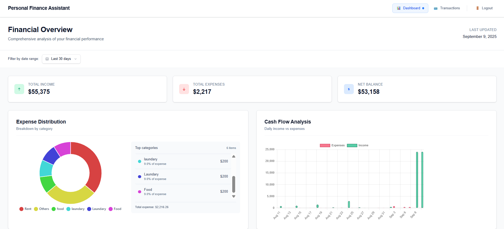

# 💰 Personal Finance Assistant (PFA)

A full-stack **personal finance management app** built with **Next.js 13 (App Router)**, **Prisma (PostgreSQL)**, **Redis**, and **React Query**.  
The app lets users **track income and expenses, upload and parse bank statements/receipts, and analyze trends with charts and filters**.

---

## ✨ Features

- 🔑 **Authentication & Sessions**

  - Session-based auth using Redis + secure cookies (`pfa_session`).
  - Session payload: `{ userId, createdAt }`.
  - Simple login/register/logout with no external providers.

- 📊 **Dashboard**

  - Key metrics: total income, total expenses, net balance.
  - Interactive charts (Chart.js):
    - **Bar chart** for category distribution.
    - **Doughnut chart** for expense breakdown.
  - **Date range filter**: 7d, 30d, YTD, or custom.
  - **Top-N category aggregation**: Dashboard charts fetch only the top N categories (default 10–12) plus an “Others” row per type.
    - This keeps payloads small and charts readable even with hundreds of categories. A full, paginated category list is available for drill-down.

- 🧾 **Transactions**

  - Add, view, and manage transactions.
  - Upload **bank statement PDFs** → parsed into structured data with `pdf-parse`.
  - Upload **receipts (POS receipts, PDFs, Images)** → raw text parsing (AI-based enrichment is a roadmap item).

- ⚡ **Metrics API**

  - Aggregates financial data by preset/custom date ranges.
  - Exposes totals, by-category breakdown, and daily series for charts.
  - Supports **pagination** for transaction list API.

- 👥 **Multi-user support**

  - Each user has isolated sessions and their own transaction data.
  - Multiple users can use the web app simultaneously.

- 🎨 **Well-structured codebase**
  - Clear separation of concerns:
    - `useMetrics` hook handles fetching, caching, retries.
    - `DateRangeFilter` is a small, reusable component.
    - `ReactQueryProvider` centralizes query client setup.
  - Debounced inputs prevent noisy requests.
  - Memoized chart transformations reduce unnecessary re-renders.
  - Loading & error states are user-friendly and actionable.
  - Modular design → easier testing, debugging, and scaling.

---

## ✅ Requirements Coverage

This project covers the following requirements:

1. **Create income/expense entries** via the web app.
2. **List income/expenses in a time range** with filtering support.
3. **Graphical analysis**: expenses by category, income vs. expenses, trends by date.
4. **Extract expenses from uploaded receipts (PDF, images, POS receipts).**
5. **Upload transaction history from tabular PDF** (e.g., bank statements).
6. **Pagination support** in list API for transactions.
7. **Multi-user support** with session-based authentication.

---

## 🛠 Tech Stack

- **Frontend:** Next.js 13, React, TailwindCSS
- **State/Data:** React Query (TanStack Query)
- **Database:** PostgreSQL (via Prisma ORM)
- **Cache & Sessions:** Redis
- **Validation:** Zod schemas
- **Charts:** Chart.js
- **File Parsing:** pdf-parse

---

## 📂 Project Structure

```
src/
 ├── app/
 │   ├── (protected)/
 │   │   ├── layout.tsx                 # Layout for protected pages (shared nav, auth checks, etc.)
 │   │   ├── dashboard/page.tsx         # Dashboard with charts & metrics
 │   │   └── transactions/page.tsx      # Transaction management
 │   ├── (public)/                      # Landing, Login & Register pages
 │   └── api/
 │       ├── auth/                      # Auth endpoints (login, register, logout, me)
 │       ├── metrics/route.ts           # Metrics aggregation
 │       ├── transactions/route.ts      # Transactions CRUD
 │       └── upload/                    # PDF upload logic
 |           ├── import/route.ts        # upload transaction history from pdf to db
 |           └── parse/route.ts         # PDF to JSON using google/flan-t5-small LLM
 ├── components/                        # Reusable UI components (cards, filters, inputs, etc.)
 ├── hooks/
 │   ├── useDebounced.ts                # Custom hook for debouncing state values (reduces noisy API requests)
 │   └── useMetrics.ts                  # Custom hook built on React Query to fetch and cache metrics data
 ├── lib/                               # Core backend utilities
 │   ├── prisma.ts                      # Prisma client (singleton) for database access
 │   ├── redis.ts                       # Redis client (singleton) for sessions/cache
 │   ├── session.ts                     # Session management (create, get, delete session)
 │   ├── schemas.ts                     # Zod schemas for validation (auth, transactions, etc.)
 │   └── types.ts                       # Shared TypeScript types
 ├── providers/ReactQueryProvider.tsx   # Centralized React Query provider
 ├── utils/                             # Helper utilities
 │   ├── formatErrors.ts                # Normalizes Zod errors for UI/API
 │   ├── datRange.ts                    # Date range presets & helpers
 │   ├── generateColors.ts              # Stable random color generator for charts
 │   ├── useDebounced.ts                # (Duplicate) Hook for debouncing values (likely to be merged into hooks/)
 │   └── useMetric.ts                   # (Duplicate) React Query hook for fetching metrics
 └── public/                            # Static assets & screenshots

```

---

## 📚 Utilities (`src/utils/`)

- **`formatErrors.ts`**  
  Normalizes Zod validation errors into a consistent format for API responses and UI messages.  
  Useful for showing clear form validation errors.

- **`datRange.ts`**  
  Provides date range helpers (e.g., last 7 days, 30 days, year-to-date).  
  Converts presets or custom ranges into `{ start, end }` ISO strings.  
  Used by the metrics API and dashboard filters.

- **`generateColors.ts`**  
  Generates stable random colors for chart categories.  
  Ensures consistent chart visualization without hardcoding.

- **`useDebounced.ts`**  
  Custom React hook to debounce state values.  
  Prevents firing API requests while a user is still typing or selecting dates.

- **`useMetric.ts`**  
  Custom React Query hook that fetches metrics.  
  Handles caching, retries, placeholder data, and avoids duplicate requests.  
  Centralizes logic for all metrics queries.

---

## 📚 Lib (`src/lib/`)

- **`prisma.ts`**  
  Initializes the Prisma client (singleton).  
  Used for all DB operations (users, transactions, etc.).

- **`redis.ts`**  
  Creates a Redis client (singleton).  
  Used for session storage and caching.

- **`session.ts`**  
  Handles session lifecycle:

  - `createSession(userId)` → generates session ID, stores `{ userId, createdAt }` in Redis, sets cookie.
  - `getSession()` → retrieves session from Redis based on cookie.
  - `deleteSession()` → clears Redis key + cookie.  
    Session TTL: 7 days by default.

- **`schemas.ts`**  
  Contains **Zod schemas** for input validation (auth, transactions, etc.).  
  Ensures consistent validation across backend and frontend.

- **`types.ts`**  
  Shared TypeScript types for transactions, metrics, sessions, etc.  
  Keeps type definitions consistent across app layers.

---

## 🔐 Authentication & Sessions

- **Session lifecycle**
  - `createSession(userId)` → saves `{ userId, createdAt }` in Redis, sets cookie.
  - `getSession()` → retrieves session data from cookie + Redis.
  - `deleteSession()` → deletes Redis key & clears cookie.
- Session TTL = 7 days (configurable).
- No roles/permissions — all users follow the same flow.

---

## 📊 API Endpoints

### Auth

- `POST /api/auth/login` — login with email/password.
- `POST /api/auth/register` — create account.
- `POST /api/auth/logout` — remove session.
- `GET /api/auth/me` — fetch current session user.

### Transactions

- `GET /api/transactions` — list transactions (supports pagination).
- `POST /api/transactions` — create transaction.

### Metrics

- `GET /api/metrics?range=30d&start=...&end=...` — aggregate totals & series.

### Upload

- `POST /api/upload/pdf` — parse bank statement PDF.
- `POST /api/upload/receipt` — parse receipt.

---

## ⚙️ Setup & Installation

1. **Clone repo**

   ```bash
   git clone https://github.com/your-username/personal-finance-assistant.git
   cd personal-finance-assistant
   ```

2. **Install dependencies**

   ```bash
   npm install
   ```

3. **Create `.env`**

   ```env
   DATABASE_URL=<your_db_url>
   REDIS_URL=<your_redis_https_url>
   ```

4. **Database setup**

   ```bash
   npx prisma migrate dev
   ```

5. **Run dev server**
   ```bash
   npm run dev
   ```

---

## 📸 Screenshots

### Dashboard



### Transactions


### Pagination


---

## 🚀 Roadmap

- ✅ Secure sessions with Redis.
- ✅ Dashboard with metrics and charts.
- ✅ PDF/receipt parsing with `pdf-parse`.
- ✅ Pagination in transaction API.
- ✅ Multi-user support.
- 🔄 Budget & savings goal tracking.
  datasets.

---

## 📄 Expected PDF Transaction Format

The parser expects each transaction to be on a **single line** in the following structure:

```
<Date>, <Time> <Type> <Category> <Description> <Amount>
```

### Example

```
9/9/2025, 3:51:00 AM INCOME sharemarket monthly-salary +$12000.00
9/7/2025, 1:32:00 AM EXPENSE laundary Sunday-evening-brunch -$200.00
```

### Field Breakdown

- **Date** → `MM/DD/YYYY` (e.g., `9/9/2025`)
- **Time** → `HH:MM:SS AM/PM` (e.g., `3:51:00 AM`)
- **Type** → Either `INCOME` or `EXPENSE`
- **Category** → Single keyword or short tag (e.g., `sharemarket`, `laundary`)
- **Description** → Free text, may contain hyphens to separate words (e.g., `monthly-salary`, `Sunday-evening-brunch`)
- **Amount** → Always prefixed with `+` for income or `-` for expense (e.g., `+$12000.00`, `-$200.00`)

### Notes

- Each line = one transaction.
- Parser assumes consistent formatting with commas separating date and time.
- Amount must include a sign (`+` / `-`) and 2 decimal places.
